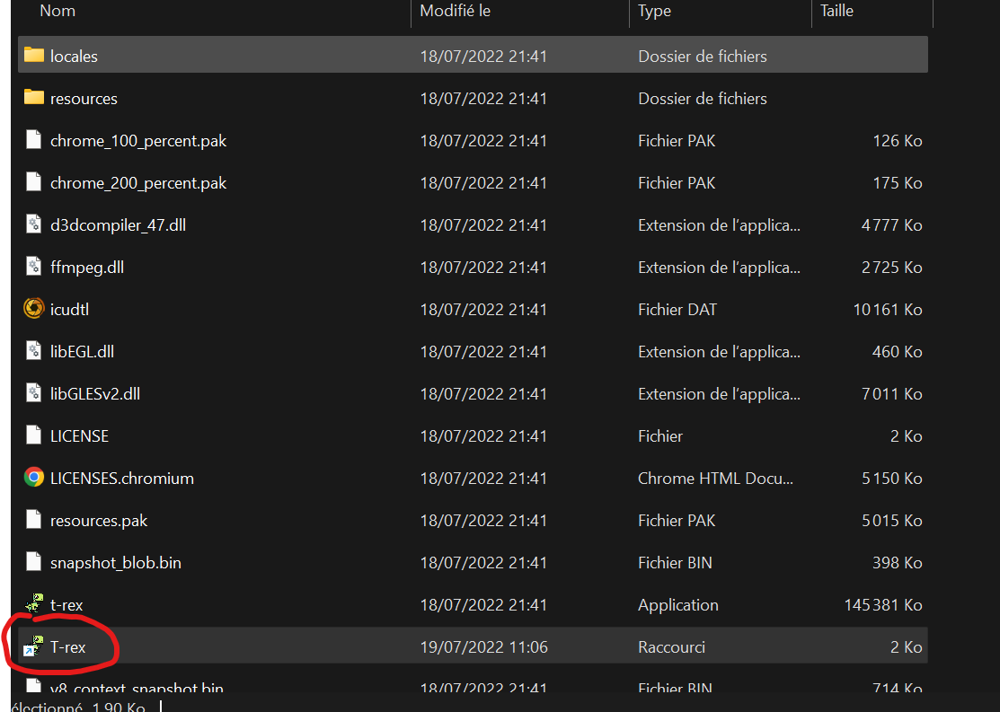

# Le T-rex runner version app. (chrome://dino)
<p>
  <a href="https://electronjs.org"></a>
  <a href="https://developer.mozilla.org/docs/Web/JavaScript"></a>
  <a href="https://github.com/Matheroli/t-rex-runner/releases"></a>
</p>

### Sommaire :
- <a href="#bien-utiliser-lapplication-">Bien utiliser l'application</a>
- <a href="#cette-application-n%C3%A9cessite-electron-ainsi-que-node-js">Utiliser correctement le code source</a>

  
### Bien utiliser l'application :

- Pour bien utiliser l'application, veuillez suivre le guide ci-dessous :

Dans le dossier une fois extrait, je conseille de créer un raccourci du fichier .exe puis de le déplacer sur le bureau pour faciliter l'accès à l'application.



Si vous souhaitez déplacer le dossier où se trouve l'application, vous pouvez le faire sans aucun risque.

### Cette application nécessite <a href="https://electronjs.org">Electron</a> ainsi que <a href="https://nodejs.org/fr">Node Js</a>.

### Pour utiliser le code source, suivez les instructions ci-dessous :

 - Installez les modules nécessaires au fonctionnement de l'app (PS: ci-dessous j'utilise <a href="https://git-scm.com/">Git</a> que je recommande fortement)

```cmd
git clone https://github.com/Matheroli/t-rex-runner
cd t-rex-runner
npm install
```

- Puis pour lancer l'application faites :

```cmd
npm start
```

- Si vous obtenez des erreurs, vérifiez si Electron est bien installé :

```cmd
npx electron --version
```

Et voilà ! L'app est prête à être utilisée !

